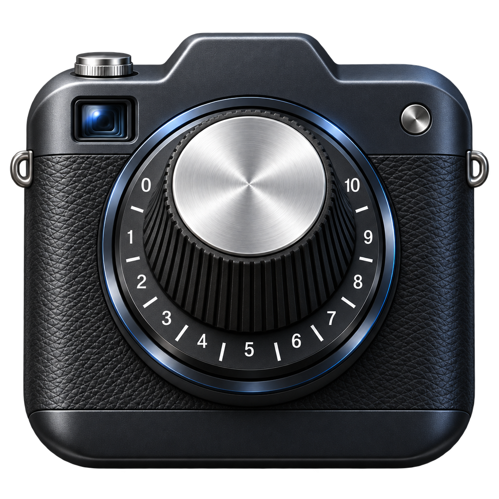

# Knobs



A Lightroom-style RAW photo editor for macOS, where every control is a plugin.

Point it at a folder of photos (RAW, JPEG, HEIC, …), edit with the knobs you know from Lightroom, and export.
Originals are never touched: edits live next to each photo in a small `<file>.knobs` JSON sidecar.

## What's in it

| Panel | Knobs |
|---|---|
| Light | Profile (camera look / neutral), Auto, Exposure, Brightness, Contrast, Highlights, Shadows, Whites, Blacks, Reconstruct Highlights |
| Color | Temp, Tint, Vibrance, Saturation |
| Presence | Texture, Clarity, Dehaze |
| Tone Curve | Point curves for RGB, Red, Green, Blue, plus Highlights / Lights / Darks / Shadows regions |
| Color Mixer | Hue, saturation and luminance for 8 colors |
| Color Grading | Shadows, midtones, highlights and global wheels, blending, balance |
| Graduated Filter | Exposure, contrast, highlights, shadows, temp, tint, saturation, clarity, dehaze across a gradient you draw |
| Detail | Noise reduction (luminance, color), sharpening (amount, radius, detail, masking) |
| Lens Corrections | Defringe (purple and green fringes) |
| Effects | Post-crop vignette, film grain |
| Crop & Straighten | On-canvas crop with aspect lock, straighten, flips |

Also: RAW highlight recovery, a per-photo camera look fitted to the JPEG your camera embeds in the RAW,
undo/redo, before/after, batch export of edited photos with EXIF kept, and a live preview that stays at
60 fps on 24 MP RAWs.

## Requirements

- macOS 15 or later on Apple silicon
- Xcode 27 (Swift 6.4) with the Metal toolchain: `xcodebuild -downloadComponent MetalToolchain`
- [XcodeGen](https://github.com/yonaskolb/XcodeGen): `brew install xcodegen`

## Build and run

```bash
scripts/generate.sh     # plugin registry + Xcode project (both generated, not committed)
scripts/install.sh      # Release build, installed as ~/Applications/Knobs.app
open ~/Applications/Knobs.app
```

`scripts/test.sh` runs the test suite. `open Knobs.xcodeproj` works too after `scripts/generate.sh`.

## Shortcuts

| Key | Does |
|---|---|
| ⌘O | Open a folder |
| ← → | Previous / next photo |
| ⌘U | Auto tone |
| \ | Before / after |
| R | Crop & straighten (Return applies, Esc cancels, X swaps orientation) |
| G | Graduated filter tool |
| ⌘Z / ⇧⌘Z | Undo / redo (a whole slider drag is one step) |
| ⇧⌘R | Reset all edits |
| ⌘E / ⇧⌘E | Export this photo / every edited photo |
| Double-click a slider's label | Reset that slider |

Right-click a photo in the filmstrip to export it, show it in Finder, remove it from Knobs (the file stays),
or move it to the Trash.

## Writing a knob

Every knob is a Swift struct conforming to `KnobPlugin` in its own folder under `KnobsKit/Plugins/`, with
optional Metal Core Image kernels next to it. Drop the folder in, rebuild, and the inspector draws its
sliders. See [CLAUDE.md](CLAUDE.md) for the plugin contract and the architecture.

## Status

A personal tool, built in a weekend with [Claude Code](https://claude.com/claude-code). Mac only for now;
the engine (`KnobsKit`) is platform-neutral, so an iPhone app can follow. Known gaps are listed in
[CLAUDE.md](CLAUDE.md#known-issues).

## License

[WTFPL](LICENSE). Do what the fuck you want to.
